```mermaid
graph TD
    subgraph "1. Inputs & Initial Configuration"
        IN_Data["Structured Data (JSON/YAML)"]
        IN_Qmd[".qmd Template (Source File)"]
        
        P0_LoadProjectConfig["(If Project) Load _quarto.yml / _metadata.yml (Global Project Settings)"]
        P1_ReadQmd["Read .qmd File Content"]
        P2_ParseYAML["Parse YAML Front Matter (Document-specific metadata, format configs, params)"]
        P3_ResolveParameters["Resolve Execution Parameters (CLI, YAML, Project Defaults)"]
        
        IN_Qmd --> P1_ReadQmd
        P1_ReadQmd --> P2_ParseYAML
        P0_LoadProjectConfig --> P2_ParseYAML
        P2_ParseYAML --> P3_ResolveParameters
    end

    subgraph "2. Content Processing & Code Execution"
        P4_PreProcessMarkdown["Markdown Pre-processing (Initial text transformations, apply some Lua filters - Pass 1)"]
        P5_LoadDataViaCode["(If applicable via Code Chunks) Load External Data (IN_Data) using Resolved Parameters (P3)"]
        P6_ExecuteCodeChunks["Execute Code Chunks (Knitr for R, Jupyter for Python/Julia - Generates Markdown, figures, tables, raw output based on 'eval' conditions)"]
        
        P3_ResolveParameters --> P4_PreProcessMarkdown
        P4_PreProcessMarkdown --> P5_LoadDataViaCode
        IN_Data -.-> P5_LoadDataViaCode
        P5_LoadDataViaCode --> P6_ExecuteCodeChunks
    end

    subgraph "3. Pandoc AST Generation & Core Transformations"
        P7_CombineContent["Combine Original Markdown & Code Chunk Outputs"]
        P8_ParseToPandocAST["Parse Combined Content into Pandoc Abstract Syntax Tree (AST)"]
        P9_ApplyCoreLuaFilters["Apply Quarto's Core Lua Filters to AST (Cross-references, Citations, Callouts, Tabsets, Layouts, Conditional Content based on target format, etc.)"]
        
        P6_ExecuteCodeChunks --> P7_CombineContent
        P7_CombineContent --> P8_ParseToPandocAST
        P8_ParseToPandocAST --> P9_ApplyCoreLuaFilters
    end

    ProcessedAST["Processed & Transformed Pandoc AST (Ready for Output Formatters)"]
    P9_ApplyCoreLuaFilters --> ProcessedAST

    subgraph "4A. HTML-Specific Output Generation"
        HTML_StartPoint{"Target Format: HTML"}
        ProcessedAST --> HTML_StartPoint

        H1_ApplyHTMLConfig["Apply HTML-Specific Configurations (from YAML: theme, toc, css, js, etc.)"]
        H2_RunHTMLFilters["Run HTML-Specific Lua Filters (if any)"]
        H3_PandocToHTML["Pandoc AST to HTML Conversion (Using HTML templates, integrating assets)"]
        H4_ProcessHTMLAssets["Collect & Process HTML Assets (CSS, JS, Images, Fonts)"]
        H5_FinalHTMLOutput["Final HTML Document(s) / Website"]

        HTML_StartPoint --> H1_ApplyHTMLConfig
        H1_ApplyHTMLConfig --> H2_RunHTMLFilters
        H2_RunHTMLFilters --> H3_PandocToHTML
        H3_PandocToHTML --> H4_ProcessHTMLAssets
        H4_ProcessHTMLAssets --> H5_FinalHTMLOutput
    end

    subgraph "4B. PDF-Specific Output Generation (via LaTeX Engine - Common Path)"
        PDF_LaTeX_StartPoint{"Target Format: PDF (Using LaTeX Engine)"}
        ProcessedAST --> PDF_LaTeX_StartPoint

        PL1_ApplyPDFLaTeXConfig["Apply PDF/LaTeX-Specific Configurations (from YAML: documentclass, papersize, fonts, LaTeX packages, include-in-header, etc.)"]
        PL2_RunLaTeXFilters["Run LaTeX-Specific Lua Filters (if any)"]
        PL3_PandocToLaTeX["Pandoc AST to LaTeX Conversion (Using LaTeX templates)"]
        PL4_CompileLaTeX["LaTeX Compilation (pdflatex, xelatex, or lualatex; multiple passes for references, ToC)"]
        PL5_FinalPDFOutput_L["Final PDF Document"]

        PDF_LaTeX_StartPoint --> PL1_ApplyPDFLaTeXConfig
        PL1_ApplyPDFLaTeXConfig --> PL2_RunLaTeXFilters
        PL2_RunLaTeXFilters --> PL3_PandocToLaTeX
        PL3_PandocToLaTeX --> PL4_CompileLaTeX
        PL4_CompileLaTeX --> PL5_FinalPDFOutput_L
    end

    subgraph "4C. PDF-Specific Output Generation (via HTML-based Engine - e.g., WeasyPrint)"
        PDF_HTML_StartPoint{"Target Format: PDF (Using HTML-based Engine)"}
        ProcessedAST --> PDF_HTML_StartPoint

        PH1_ApplyPDFHTMLConfig["Apply PDF/HTML-Engine-Specific Configurations (from YAML: engine choice, CSS for paged media)"]
        PH2_GenerateIntermediateHTML["Generate Intermediate HTML (Similar to HTML path but optimized for paged media, applying specific CSS)"]
        PH3_ConvertHTMLToPDF["Convert Intermediate HTML to PDF (Using WeasyPrint, PagedJS, etc.)"]
        PH4_FinalPDFOutput_H["Final PDF Document"]
        
        H1_ApplyHTMLConfig -.-> PH2_GenerateIntermediateHTML
        H3_PandocToHTML -.-> PH2_GenerateIntermediateHTML

        PDF_HTML_StartPoint --> PH1_ApplyPDFHTMLConfig
        PH1_ApplyPDFHTMLConfig --> PH2_GenerateIntermediateHTML
        PH2_GenerateIntermediateHTML --> PH3_ConvertHTMLToPDF
        PH3_ConvertHTMLToPDF --> PH4_FinalPDFOutput_H
    end
``` 

# Ideation Process for Academic Research in Supply Chain

## Phase 1: Preparation & Problem Definition

Begin by clarifying the research focus and scope.  Map out the supply chain problem, stakeholders, and objectives in broad terms.  For example, use a **mind map** (with Freeplane) to visually organize known factors (e.g. processes, actors, constraints). Freeplane is a free, open-source mind-mapping tool that “supports thinking, sharing information… in work, school and home”.  This helps structure complex information and reveal gaps.  Also apply the **5 Whys** technique: repeatedly ask “Why?” to peel away layers of a problem and reach its root cause.  (For instance, ask why delays occur in a supply chain issue.) The 5 Whys is an iterative interrogative method aimed at identifying the true root cause of a problem.

* **Tool – Freeplane (Mind Mapping):** An open-source concept-mapping application. Draw a map of the supply chain domain (inventory, logistics, demand, etc.) to clarify relationships and goals.
* **Method – 5 Whys:** Repeatedly question the problem (“Why is X happening?”) to drill down to root causes. This ensures the idea addresses the core issue, not just a symptom.

## Phase 2: Background Research & Contextualization

Gather existing knowledge on the topic to inform ideation. Conduct a literature review of academic papers, industry reports, and case studies in your supply chain area. Organize insights and keywords from the literature in a concept map or annotated notes. For example, use Freeplane (again) or similar concept-mapping tools to cluster related ideas and theories. (Zotero or another reference manager can help collect and tag sources.) This mapping of context helps highlight gaps or trends. Freeplane’s mind mapping can link key concepts, references and findings, making it easier to see where new ideas fit.

* **Tool – Freeplane (Concept Mapping):** Use it to diagram key concepts, theories, and findings from the literature. Group themes (e.g. “sustainable sourcing”, “digitalization”) to identify unexplored intersections.
* **Tool – Zotero (Reference Manager):** Collect and tag papers. Create lists of questions or quotes to trigger new ideas. (Any free bibliography tool works; Zotero is widely used.)

## Phase 3: Brainstorming & Ideation

Generate a wide range of possible ideas without judgment. Conduct free-form brainstorming sessions (individually or with a team) to list innovations, improvements, or hypotheses. Use collaborative tools to capture thoughts. For instance, a **digital whiteboard** like Excalidraw enables drawing and writing in real time. Excalidraw is an open-source, end-to-end encrypted virtual whiteboard that supports sketching diagrams in a hand-drawn style. Such tools let you jot down ideas, draw flowcharts or doodles, and continuously build on them. In these sessions, encourage quantity: defer criticism, combine ideas, and even use prompts (like “What if we swapped steps in the process?”).

&#x20;*Figure: A team using a virtual whiteboard to brainstorm ideas collaboratively (e.g. sketching and grouping concepts on a shared online canvas).*

* **Tool – Excalidraw (Collaborative Whiteboard):** An open-source digital board for freehand drawing and note-taking. Use it to sketch process flows or concept maps together.
* **Technique – Brainwriting:** Have participants write down ideas independently before sharing, to ensure diverse contributions. (Variations: silent group sketching, round-robin idea generation, etc.)

## Phase 4: Structured Ideation (SCAMPER, Fishbone, etc.)

Apply systematic creativity methods to expand and refine ideas. One powerful approach is **SCAMPER**, which prompts you to ask: *Substitute, Combine, Adapt, Modify (Magnify/Minify), Put to another use, Eliminate, or Reverse* aspects of an existing process or idea. SCAMPER encourages lateral thinking: for each item in the supply chain, ask these questions to generate new angles. For example, “What if we **eliminate** paperwork by automating orders?” or “How could we **combine** two transport modes?”

Another method is the **Fishbone (Ishikawa) diagram**, a cause-and-effect chart. Draw a “fishbone” to list all possible factors influencing a problem (e.g. categories like People, Process, Technology, Materials). This visual tool helps systematically explore root causes and sub-issues. By brainstorming under each category, you generate ideas targeted at specific issues. (Printable Fishbone diagram templates can be used, or sketch one in Freeplane/Draw\.io.)

* **SCAMPER Checklist:** A structured worksheet or mind map form of SCAMPER questions. Use it to tweak and transform initial ideas. (Free printable SCAMPER templates are widely available.)
* **Fishbone Diagram:** A causal analysis diagram (Ishikawa) for brainstorming all factors related to a challenge. Use it to group idea generation around different branches (e.g. “What technology issues affect lead times?”).

## Phase 5: Idea Evaluation & Prioritization

Filter and compare the brainstormed ideas to identify the most promising ones. Use analysis tools to weigh benefits, feasibility, and risks. For example, perform a **SWOT analysis** on each top idea: list its Strengths, Weaknesses, Opportunities, and Threats. This frames internal and external factors for academic/supply chain initiatives (e.g. a new blockchain solution’s strengths vs. cost/skill gaps). SWOT helps spot which ideas align well with goals or face critical obstacles.

Also consider simple matrices: an **Impact/Effort (Value vs. Feasibility) matrix** or a weighted decision table. For instance, plot ideas on a 2×2 grid (High vs. Low Impact and Effort) to spotlight quick wins. Or assign scores to criteria (resources needed, novelty, expected benefit) and rank ideas. (Open-source spreadsheet software can be used to build these matrices.) The goal is to narrow the list by pragmatic criteria.

* **Tool – SWOT Analysis:** A structured template (printable matrix) for each idea. Analyze strengths/weaknesses (internal) and opportunities/threats (external) to assess viability. This ensures ideas are examined from multiple angles.
* **Technique – Impact/Effort Matrix:** Prioritize by plotting or scoring ideas on impact versus effort. Helps select ideas that yield high benefit with reasonable effort.

## Phase 6: Selection & Refinement

Select the top idea(s) based on the evaluation. Then refine the chosen concept into a clear research question or project plan. Revisit root causes: you can re-apply **5 Whys** to ensure the solution tackles the true problem identified. Check again with a quick fishbone if needed, verifying that all critical factors have been addressed. Finally, outline next steps with a project plan or canvas. Use an open Gantt tool (like GanttProject) or simply a printed timeline template to schedule tasks (e.g. detailed literature review, experiments, data collection).

In this phase you solidify the idea into an actionable direction. For example, draft the refined hypothesis, list required resources, and identify key milestones. Some teams also reuse SWOT on the final idea to double-check strategic fit. The result should be a well-defined research concept or proposal ready for implementation.

* **Tool – 5 Whys / Fishbone (again):** Apply them one more time on the refined idea to confirm you’ve truly addressed the core issue. This guards against superficial fixes.
* **Tool – Planning Template (Project Canvas/Gantt):** Use a project planning template or open-source software to detail how to execute the idea. This might include objectives, tasks, roles, and timeline.

Each phase builds on the last, moving from broad understanding to a focused, refined idea. By iterating between creative brainstorming and structured analysis (using tools like Freeplane, Excalidraw, SCAMPER, SWOT, etc.), researchers in the supply chain field can generate innovative ideas and then rigorously select and refine the most promising one.
