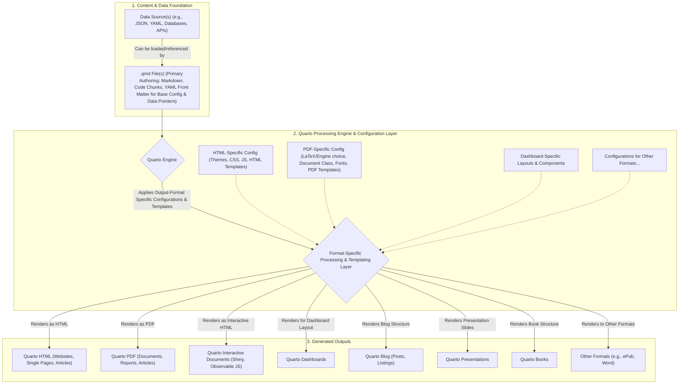

| **Name**                                                   | **Description (Schema + Quarto Template Integration)**                                                                                                                                                                                                                                                                                                                                                                                                       | **Link**                                                                          |
| ---------------------------------------------------------- | ------------------------------------------------------------------------------------------------------------------------------------------------------------------------------------------------------------------------------------------------------------------------------------------------------------------------------------------------------------------------------------------------------------------------------------------------------------ | --------------------------------------------------------------------------------- |
| **JSKOS (JSON Schema for Knowledge Organization Systems)** | Defines a JSON-based format for Knowledge Organization Systems, with the spec written in Quarto. The repository includes JSON Schema files for the JSKOS format and a Quarto `.qmd` document that renders the human-readable specification. Examples in the repo are validated against the JSON Schema and the Quarto template integrates these structured definitions into published documentation.                                                         | **Repo:** [gbv/jskos](https://github.com/gbv/jskos)                               |
| **Avram Schema Language**                                  | An academic specification for a schema language (for MARC/PICA/MAB library metadata) that uses Quarto for its documentation. The project contains a formal schema (`schema.yaml` in JSON Schema syntax) alongside a Quarto-based spec document. The Quarto template renders the Markdown spec (with embedded schema details) into a formatted site, ensuring the structured YAML schema and narrative stay in sync.                                          | **Repo:** [dini-ag-kim/avram](https://github.com/dini-ag-kim/avram)               |
| **DSO (Data Science Operations)**                          | A command-line tool for reproducible research pipelines that marries structured configs with Quarto reporting. DSO uses structured YAML configuration files and Jinja2 templates to orchestrate analyses, and it integrates with Quarto to generate output reports/notebooks. This allows data pipelines (versioned with DVC) to feed into Quarto `.qmd` templates for automated report generation in academic workflows.                                    | **Repo:** [Boehringer-Ingelheim/dso](https://github.com/Boehringer-Ingelheim/dso) |
| **iSamples Metadata Documentation**                        | The iSamples project (material sample metadata) uses LinkML (YAML-based schema definitions) coupled with Quarto for documentation. The repository contains structured schema files in YAML and custom Quarto templates that generate a documentation website from those schemas. Quarto’s rendering engine is used (in place of MkDocs/Sphinx) to include computed examples and ensure the JSON/YAML schema definitions are reflected in the published docs. | **Repo:** [isamplesorg/metadata](https://github.com/isamplesorg/metadata)         |

"The System Architect (the 'user' initiating this conversation) is designing and aims to implement a comprehensive, template-driven, data-separated publishing framework. This framework will leverage Quarto as its primary rendering engine. The central goal is to empower end-users—who may range from students and researchers to professionals and hobbyists, and who are not necessarily experts in document formatting or web development—to reliably and easily produce consistent, high-quality, and potentially multi-format documents for a variety of predefined purposes (e.g., research articles, project websites, workshop materials, D&D world guides).
The framework is architected around creating distinct 'Document Type Packages.' Each package will consist of two primary, tightly coupled components:
a) Data_Schemas (typically defined in JSON Schema or as a well-structured YAML 'template for data'):
* Purpose: For each specific document type, a Data_Schema will meticulously define the required and optional content fields, their data types (e.g., string, number, boolean, array, nested objects), hierarchical relationships, and any constraints or enumerated values.
* Function:
* It acts as an unambiguous contract for the content.
* It serves as a clear guide for end-users, showing them precisely what information needs to be provided and how it should be structured for a given document type.
* It ensures consistency and predictability of the input data which is fed into the rendering process.
* It forms a critical foundation for future, optional AI-powered assistance, as the AI can be programmed to understand and help populate data according to this predefined schema.
* It facilitates validation of the user-provided data before rendering.
b) Quarto_Presentation_Templates (as .qmd files):
* Purpose: For each Data_Schema, there will be a corresponding .qmd template. This template defines the visual layout, styling, static content, and dynamic rendering logic for that specific document type.
* Function:
* It is designed to ingest and interpret a data instance that conforms to its associated Data_Schema.
* It uses Quarto's features (Markdown, YAML front matter, embedded code chunks in languages like Python or R, Pandoc capabilities, and Lua filters) to map the structured data from the instance to the document's visual elements.
* The YAML front matter within the .qmd will manage document metadata (title, author, etc., often sourced from the data instance) and crucially, format-specific configurations to tailor the output for different targets (e.g., HTML, PDF). This includes specifying themes, CSS, LaTeX parameters, PDF engines, and other rendering options.
* It can contain conditional logic (e.g., content-visible when-format="html", or conditional evaluation of code chunks) to adapt the presentation optimally for different output formats (like a website versus a PDF).
The overarching goal of this framework is to enable end-users to:
Focus on Content Creation: Users will interact primarily with the Data_Schema for their chosen document type, focusing on providing the necessary information in a structured JSON or YAML file (a Data_Instance). This abstracts away the complexities of layout and multi-format rendering.
Achieve Consistent Outputs: By using the standardized Data_Schema and the corresponding Quarto_Presentation_Template, all documents of a particular type will have a uniform structure, branding, and quality, regardless of who created the content.
Generate High-Quality Documents: The Quarto_Presentation_Templates will be expertly designed by the System Architect to produce professional-looking outputs, leveraging Quarto's powerful rendering capabilities.
Produce Multi-Format Outputs Efficiently: The system aims to allow generation of different output formats (e.g., an HTML website and a print-ready PDF article) from the same structured Data_Instance and a single (or largely single) .qmd template, with Quarto handling the format-specific adaptations as defined in the template. This reduces redundant effort and ensures content synchronization across formats.
The design explicitly considers future, optional AI-powered assistance for end-users:
The rigorously defined Data_Schemas are not just for human users but are also intended to provide a clear structure that an AI can understand. This would allow an AI to:
* Assist users in populating the JSON/YAML Data_Instance based on unstructured notes or prompts.
* Validate user input against the schema.
* Potentially summarize or transform data within the structured fields.
This AI assistance is an enhancement to the core user workflow, not a dependency for the framework's primary function.
In summary, the System Architect is building an opinionated, structured content generation pipeline. It standardizes the input data structure via schemas and the output presentation via Quarto templates. This allows for the efficient, consistent, and high-quality production of diverse document types by users who can then focus on their core content rather than on the technical intricacies of document production and formatting."

# Ideation Process for Academic Research in Supply Chain

## Phase 1: Preparation & Problem Definition

Begin by clarifying the research focus and scope.  Map out the supply chain problem, stakeholders, and objectives in broad terms.  For example, use a **mind map** (with Freeplane) to visually organize known factors (e.g. processes, actors, constraints). Freeplane is a free, open-source mind-mapping tool that “supports thinking, sharing information… in work, school and home”.  This helps structure complex information and reveal gaps.  Also apply the **5 Whys** technique: repeatedly ask “Why?” to peel away layers of a problem and reach its root cause.  (For instance, ask why delays occur in a supply chain issue.) The 5 Whys is an iterative interrogative method aimed at identifying the true root cause of a problem.

* **Tool – Freeplane (Mind Mapping):** An open-source concept-mapping application. Draw a map of the supply chain domain (inventory, logistics, demand, etc.) to clarify relationships and goals.
* **Method – 5 Whys:** Repeatedly question the problem (“Why is X happening?”) to drill down to root causes. This ensures the idea addresses the core issue, not just a symptom.

## Phase 2: Background Research & Contextualization

Gather existing knowledge on the topic to inform ideation. Conduct a literature review of academic papers, industry reports, and case studies in your supply chain area. Organize insights and keywords from the literature in a concept map or annotated notes. For example, use Freeplane (again) or similar concept-mapping tools to cluster related ideas and theories. (Zotero or another reference manager can help collect and tag sources.) This mapping of context helps highlight gaps or trends. Freeplane’s mind mapping can link key concepts, references and findings, making it easier to see where new ideas fit.

* **Tool – Freeplane (Concept Mapping):** Use it to diagram key concepts, theories, and findings from the literature. Group themes (e.g. “sustainable sourcing”, “digitalization”) to identify unexplored intersections.
* **Tool – Zotero (Reference Manager):** Collect and tag papers. Create lists of questions or quotes to trigger new ideas. (Any free bibliography tool works; Zotero is widely used.)

## Phase 3: Brainstorming & Ideation

Generate a wide range of possible ideas without judgment. Conduct free-form brainstorming sessions (individually or with a team) to list innovations, improvements, or hypotheses. Use collaborative tools to capture thoughts. For instance, a **digital whiteboard** like Excalidraw enables drawing and writing in real time. Excalidraw is an open-source, end-to-end encrypted virtual whiteboard that supports sketching diagrams in a hand-drawn style. Such tools let you jot down ideas, draw flowcharts or doodles, and continuously build on them. In these sessions, encourage quantity: defer criticism, combine ideas, and even use prompts (like “What if we swapped steps in the process?”).

&#x20;*Figure: A team using a virtual whiteboard to brainstorm ideas collaboratively (e.g. sketching and grouping concepts on a shared online canvas).*

* **Tool – Excalidraw (Collaborative Whiteboard):** An open-source digital board for freehand drawing and note-taking. Use it to sketch process flows or concept maps together.
* **Technique – Brainwriting:** Have participants write down ideas independently before sharing, to ensure diverse contributions. (Variations: silent group sketching, round-robin idea generation, etc.)

## Phase 4: Structured Ideation (SCAMPER, Fishbone, etc.)

Apply systematic creativity methods to expand and refine ideas. One powerful approach is **SCAMPER**, which prompts you to ask: *Substitute, Combine, Adapt, Modify (Magnify/Minify), Put to another use, Eliminate, or Reverse* aspects of an existing process or idea. SCAMPER encourages lateral thinking: for each item in the supply chain, ask these questions to generate new angles. For example, “What if we **eliminate** paperwork by automating orders?” or “How could we **combine** two transport modes?”

Another method is the **Fishbone (Ishikawa) diagram**, a cause-and-effect chart. Draw a “fishbone” to list all possible factors influencing a problem (e.g. categories like People, Process, Technology, Materials). This visual tool helps systematically explore root causes and sub-issues. By brainstorming under each category, you generate ideas targeted at specific issues. (Printable Fishbone diagram templates can be used, or sketch one in Freeplane/Draw\.io.)

* **SCAMPER Checklist:** A structured worksheet or mind map form of SCAMPER questions. Use it to tweak and transform initial ideas. (Free printable SCAMPER templates are widely available.)
* **Fishbone Diagram:** A causal analysis diagram (Ishikawa) for brainstorming all factors related to a challenge. Use it to group idea generation around different branches (e.g. “What technology issues affect lead times?”).

## Phase 5: Idea Evaluation & Prioritization

Filter and compare the brainstormed ideas to identify the most promising ones. Use analysis tools to weigh benefits, feasibility, and risks. For example, perform a **SWOT analysis** on each top idea: list its Strengths, Weaknesses, Opportunities, and Threats. This frames internal and external factors for academic/supply chain initiatives (e.g. a new blockchain solution’s strengths vs. cost/skill gaps). SWOT helps spot which ideas align well with goals or face critical obstacles.

Also consider simple matrices: an **Impact/Effort (Value vs. Feasibility) matrix** or a weighted decision table. For instance, plot ideas on a 2×2 grid (High vs. Low Impact and Effort) to spotlight quick wins. Or assign scores to criteria (resources needed, novelty, expected benefit) and rank ideas. (Open-source spreadsheet software can be used to build these matrices.) The goal is to narrow the list by pragmatic criteria.

* **Tool – SWOT Analysis:** A structured template (printable matrix) for each idea. Analyze strengths/weaknesses (internal) and opportunities/threats (external) to assess viability. This ensures ideas are examined from multiple angles.
* **Technique – Impact/Effort Matrix:** Prioritize by plotting or scoring ideas on impact versus effort. Helps select ideas that yield high benefit with reasonable effort.

## Phase 6: Selection & Refinement

Select the top idea(s) based on the evaluation. Then refine the chosen concept into a clear research question or project plan. Revisit root causes: you can re-apply **5 Whys** to ensure the solution tackles the true problem identified. Check again with a quick fishbone if needed, verifying that all critical factors have been addressed. Finally, outline next steps with a project plan or canvas. Use an open Gantt tool (like GanttProject) or simply a printed timeline template to schedule tasks (e.g. detailed literature review, experiments, data collection).

In this phase you solidify the idea into an actionable direction. For example, draft the refined hypothesis, list required resources, and identify key milestones. Some teams also reuse SWOT on the final idea to double-check strategic fit. The result should be a well-defined research concept or proposal ready for implementation.

* **Tool – 5 Whys / Fishbone (again):** Apply them one more time on the refined idea to confirm you’ve truly addressed the core issue. This guards against superficial fixes.
* **Tool – Planning Template (Project Canvas/Gantt):** Use a project planning template or open-source software to detail how to execute the idea. This might include objectives, tasks, roles, and timeline.

Each phase builds on the last, moving from broad understanding to a focused, refined idea. By iterating between creative brainstorming and structured analysis (using tools like Freeplane, Excalidraw, SCAMPER, SWOT, etc.), researchers in the supply chain field can generate innovative ideas and then rigorously select and refine the most promising one.
